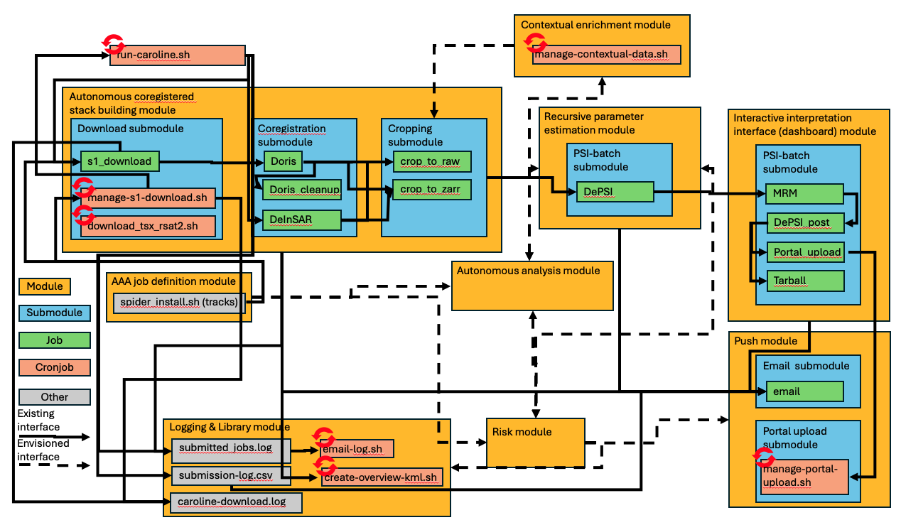

# CAROLINE Architecture

## Current architecture overview

## Modules
There are nine modules:
1. The autonomous coregistered stack building module
    - Goal: continuously check for new downlinked SAR acquisitions, retrieve them, align them, resample them, and produce geometrically reduced SLCs
2. The AAA job definition module
    - Goal: facilitate the formulation of objectives, boundary conditions, AOI/TOI, and translate these to parameterization choices, functional and stochastic model choices, and required quality and spatio-temporal density and extent criteria using in _module 4_.
3. The contextual enrichment module
   - Goal: retrieve relevant contextual information and convert them for ingestion in _module 4_.
4. The recursive parameter estimation module
   - Goal: Perform triple-A estimation of parameters and quality using the methods defined by _module 2_.
5. The autonomous analysis module
   - Goal: Detect and identify patters, geophysical, and structural models using a non-limited library of methods. It operates autonomously on the estimated parameters from _module 4_.
6. The risk module
   - Goal: Use quality metrics derived from the initial parameter estimation (_module 4_), contextual information (_module 3_) and information on the required confidence levels and discriminatory power from the job definition (_module 2_).
7. The interactive interpretation interface (dashboard) module
   - Goal: Visualize the estimated parameters using a spatial and temporal querying system
8. The push module
   - Goal: Notify designated end users automatically, or a multi-disciplinary interpretation team (MIT) based on predefined criteria in _module 2_.
9. The logging & library module
   - Goal: Ensure that the output products and recipes are transparent and retrievable.

## Submodules

### Autonomous coregistered stack building module
- Download submodule
  - Goal: download radar data from all satellites.
- Coregistration submodule
  - Goal: perform the basic interferometric procedure per image pair. This includes orbit corrections, coregistration, resampling, burst merging, interferogram generation, reference phase and DEM (including reference ellipsoid) subtraction, geocoding, and coherence estimation.
- Cropping submodule
  - Goal: create reduced SLCs of the AoI, and crop as preparation for the Recursive parameter estimation module.

### Recursive parameter estimation module
- PSI batch submodule
  - Goal: Run a PSI-batch analysis over the AoI

### Interactive interpretation interface (dashboard) module
- PSI batch submodule
  - Goal: Prepare the results of a PSI-batch analysis for interpretation

### Push module
- Email submodule
  - Goal: Send email notifications to designated end users
- Portal upload submodule
  - Goal: Upload prepared datasets to the SkyGeo portal

## Jobs
See [the specificatins in the glossary](glossary.md#jobs)

## Cronjobs
- [run-caroline.sh](../scripts/run-caroline.sh) checks for new downloads every 5 hours and starts the corresponding workflows as defined in the `config` directory.
- [manage-portal-upload.sh](../scripts/manage-portal-upload.sh) checks every hour if new jobs are ready to be pushed to the portal.
- [manage-s1-download.sh](../scripts/manage-s1-download.sh) checks every hour if new images over all AoIs have become available, and downloads them
- [create-overview-kml.sh](../scripts/create-overview-kml.sh) creates an overview of all available data on Spider at 2am every night.
- [manage-contextual-data.sh](../scripts/manage-contextual-data.sh) updates the contextual data as defined in the [contextual data definitions](../config/contextual-data-definitions.yaml) at 2am every night.
- [email-log.sh](../scripts/email-log.sh) sends an email to an admin account at 1am every night containing everything that happened the previous day.

## Other
- [spider_install.sh](../spider-install.sh) figures out the tracks over each AoI (as part of installing CAROLINE on Spider)
- `submission-log.csv` logs every job submitted by [run-caroline.sh](../scripts/run-caroline.sh) in machine-readable CSV format for the email
- `submitted_jobs.log` logs the submission, start, and finish of every individual job in human-readable format
- `caroline-download.log` logs the activity of the `caroline-download` plugin, including the submitted queries by [manage-s1-download.sh](../scripts/manage-s1-download.sh) and the `s1_download` job, as well as which files are actually downloaded and where they are stored.

