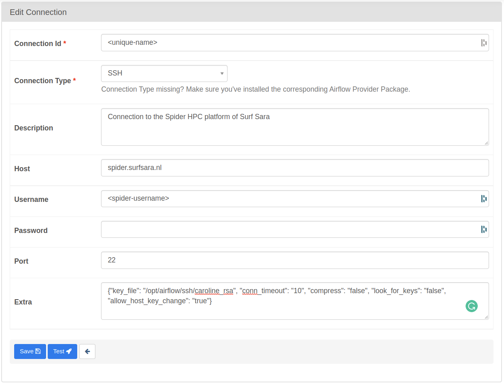

# Connections

Custom operators required a sshHook and, therefore, an SSH connection. Connections are defined via the Apache Airflow UI. 

## SSH Connection

Below we describe how to set up an SSH connection to Spider.

**Required:**
* SSH private key registered to the Surf Sara portal. See [setting up an account on Spider](http://doc.spider.surfsara.nl/en/latest/Pages/getting_started.html#setting-up-your-account)
* Admin account to the [Airflow Instace](http://caroline.citg.tudelft.nl:8080/)
* Admin access to the VM running the Airflow instance

1. On the Airflow UI go to Admin > Connections and press the PLUS button to add a new record (connection).
2. Configure the connection as shown in the image below:



3. The extra field should contain a JSON file as follows:

```json
{"key_file": "/opt/airflow/ssh/<private-key>", "conn_timeout": "10", "compress": "false", "look_for_keys": "false", "allow_host_key_change": "true"}
```
4. Log in to the Airflow VM and place a copy of the private key in the `/opt/airflow/ssh/` directory.

## Using a connection

Connections like the one above are used to define *Hooks* in DAGs. Below is an example of using an SSH connection to define an SSH Hook in a DAG.

```python
from airflow.contrib.hooks.ssh_hook import SSHHook

sshHook = SSHHook(ssh_conn_id='<connection-id>') 

```