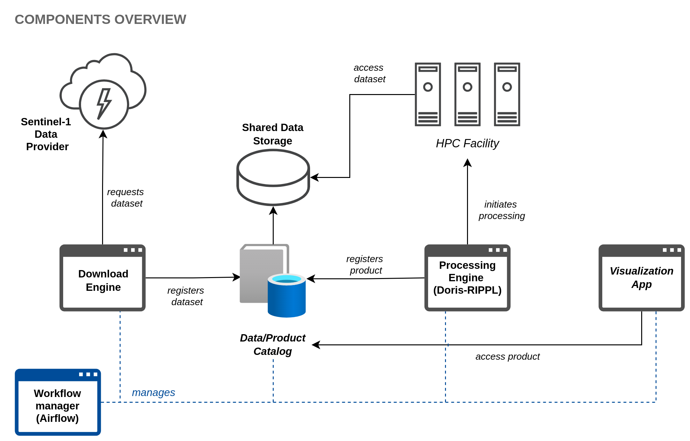
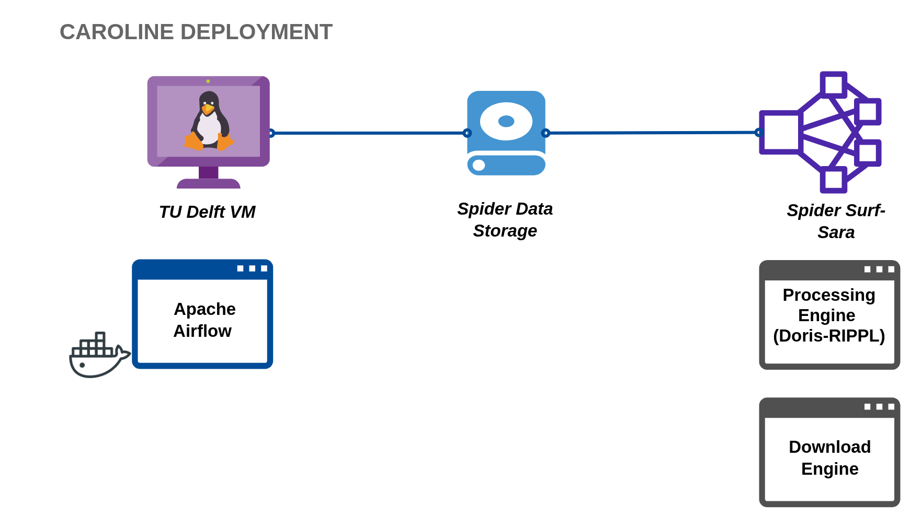

# CAROLINE System

A distributed system for the processing of SAR datasets.

## Purpose

To enable the efficient processing chain for satellite imaging SAR data for batch (historical mode) and continuous (monitoring mode) processing. The system produces satellite data products such as interferograms.

## Components Overview

The diagram below presents a high-level overview of the components of the Caroline system. The download engine is responsible for periodically checking the availability of raw datasets in the data provider and downloading datasets to the system's storage. The Processing engine (based on the latest version of Doris-Rippl) transforms datasets into data products. The Visualisation Appm, a web application, enables the visualisation of the raw data and products stored in the system's catalogue.

Processing of datasets takes place in an HPC facility due to the heavy computation required for the production of data products. A workflow manager controls and automates the process of downloading, processing and displaying data.

## Implementation

The implementation is a work in progress. The [Download](download-engine.md)  and [Processing](processing-engine.md) Engines are implemented as Python packages with CLI interfaces. Workflows are also implemented in Python using [Apache Airflow](airflow.md). For details, consult documentation specific to each component.

## Deployment

Currently, the components of the system are deployed as follows:

* The download and processing engines are deployed on a login node of Spider, the high throughput computing platform by Surf-Sara.
* The workflow manager (Apache Airflow) is running in a virtual machine (VM) provided by TU Delft. The VM has limited resources (1 CPU: `Intel(R) Xeon(R) Gold 6248 CPU @ 2.50GHz`, and 2 GB RAM), but they can be extended within certain limitations.
* Data (raw datasets and data products) are downloaded and stored directly to the data storage available to the research group in Spider.

For more details see the [deployment documentation](deployment.md)

