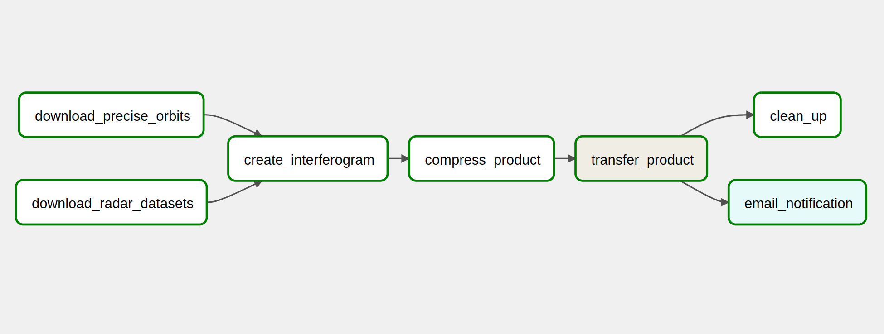

# Template Interferogram

A template DAG for the countinous production of inteferograms in the Caroline System. Templated fields in Airflow are specified using Jinja 2, and they are declared as `{{dag_run.conf["<json key/name>"]}}`.

The purpose of this DAG is to be used as part of the implementation of the *monitoring mode* in Caroline. The monitoring mode focuses on the production of new products whenever new Sentinel-1 datasets are made available by the data providers for an specific region. 

The [interferogram.py](../airflow/dags/interferogram.py) DAG defines the workflow illustrated below:



## Tasks

### download_radar_datasets
Executes the `cmd_download_radar` commands in Spider:

```python
download_radar = DownloadOperator(
task_id='download_radar_datasets',
command=cmd_download_radar,
ssh_hook=sshHook,
dag=dag)

```

* **cmd_download_radar:**
    Use the Download Engine to search and download Sentinel-1 datasets from the ASF API.    

    ```python
    cmd_download_radar ="""
    python main.py conf {{dag_run.conf["start_date"]}} {{dag_run.conf["end_date"]}} -f {{dag_run.conf["geometry"]}} -o {{dag_run.conf["orbit_direction"]}} 
    """

    ```


### download_precise_orbits
Executes the `cmd_download_precise_orbits` commands in Spider:

```python
download_precise_orbits = DownloadOperator(
task_id='download_precise_orbits',
command=cmd_download_precise_orbits,
ssh_hook=sshHook,
dag=dag)

```

* **cmd_download_precise_orbits:**
    Use the Download Engine to search and download precise orbit files.

    ```python
    cmd_download_precise_orbits ="""
    python orbits.py conf {{dag_run.conf["start_date"]}} {{dag_run.conf["end_date"]}} --type POE
    """

    ``` 

### create_interferogram

Executes commands in the `sbatch_body` for the creation of interograms in Spider:

```python
create_interferogram = SBATCHOperator(
task_id='create_interferogram',
sbatch_commands=sbatch_body,
script_name="test_sbatch.sh",
max_time='59:59',
frequency = '10s',
output_dir= "/project/caroline/Share/users/caroline-mgarcia/sbatch",
cores=2,
ssh_hook=sshHook,
dag=dag)

```

* **sbatch_body:**
    Commands to be executed as a slurm job in spider. These commands become the body of a sbatch script, and it uses the Processing Engine to produce interferograms.

    ```python
    sbatch_body = """
    # load dependencies
    source /project/caroline/Software/bin/init.sh &&
    module load python/3.9.6  gdal/3.4.1 proj/8.2.1
    # Activate virtual environment 
    source /project/caroline/Software/caroline/caroline-venv/bin/activate
    cd /project/caroline/Share/users/caroline-mgarcia
    # path to processing eninge
    PROGRAM="/project/caroline/Software/caroline/processing/processing/interferogram/main.py"
    python $PROGRAM --start_date {{dag_run.conf['start_date']}} --end_date {{dag_run.conf['end_date']}} --mdate {{dag_run.conf["master_date"]}} --processes {{dag_run.conf["processes"]}} --name {{dag_run.conf["stack_name"]}} --file {{dag_run.conf["geometry"]}} --resplanar {{dag_run.conf["planar_resolution"]}} --pol {{dag_run.conf["polarisation"]}}  || exit 91
    """

    ```


### compress_product

Executes the `cmd_file_compression` commands in Spider:

```python
compress_file = SSHOperator(
task_id='compress_product',
command=cmd_file_compression,
ssh_hook=sshHook,
dag=dag
)

```

* **cmd_file_compression:**
    Use ZIP to compress the interferogram files produced by the Processing Egine.

    ```python
    cmd_file_compression="""
    zip -r /project/caroline/Share/users/caroline-mgarcia/products/sentinel1/{{dag_run.conf["stack_name"]}}/interferogram.zip /project/caroline/Share/users/caroline-mgarcia/products/sentinel1/{{dag_run.conf["stack_name"]}}/interferogram 
    """

    ```


### transfer_product

Executes the `cmd_transfer_file` commands in Airflow VM.

```python
transfer_file = BashOperator(
task_id='transfer_product',
bash_command=cmd_transfer_file,
dag=dag
)
```

* **cmd_transfer_file:**
    Use SCP to copy a compressed copy of interferogram files from Spider to `/opt/airflow/data/temp/` in the Airflow VM.

    ```python
    cmd_transfer_file ="""
    scp -i /opt/airflow/ssh/caroline_rsa -o StrictHostKeyChecking=no caroline-mgarcia@spider.surfsara.nl:/project/caroline/Share/users/caroline-mgarcia/products/sentinel1/{{dag_run.conf["stack_name"]}}/interferogram.zip /opt/airflow/data/temp/interf-{{dag_run.conf["stack_name"]}}.zip
    """

    ```

    > WARNING: `StrictHostKeyChecking=no` will automatically accepts connections from any host. This reduces security. Ideally host verification is handled in a different way.


### cleand_up

Executes the `cmd_clean_up` commands in Spider:

```python
clean_up = SSHOperator(
task_id='clean_up',
command=cmd_clean_up,
ssh_hook=sshHook,
dag=dag
)

```

* **cmd_clean_up:**
    Deletes compressed copy of interferogram files from the Spider's directory.

    ```python
    cmd_clean_up="""
    rm /project/caroline/Share/users/caroline-mgarcia/products/sentinel1/{{dag_run.conf["stack_name"]}}/interferogram.zip
    """

    ```

### email_notification

Sends email notifying a new interferogram has been created using the message in `email_message`, and attaching files in `files`:

```python
send_email = EmailOperator(
task_id='email_notification',
to=['<net-ide>@tudelft.nl']
subject='New Sentinel-1 Product',
html_content = email_message,
files=['/opt/airflow/data/temp/interf-{{dag_run.conf["stack_name"]}}.zip'],
dag=dag
)

```

* **email_message:**
    Defines the email message for notifying of the creation of a new interferogram as HTML.

    ```python
    email_message= """
    <p>Hello,</p> 
    <p>A new interferogram has been produced for <b>{{dag_run.conf["stack_name"]}}</b>. See attachment.</p> 
    <p>Greetings,</p>
    <p><em>Caroline Development Team</em></p>
    """

    ```

## Dependency Graph

The tasks *download_precise_orbits* and *download_radar_datasets* are run in paraller at the begining of the workflow, and the tasks *clean_up* and *email_notification* are run in parallel at the end. Depencies are defined as follows:


```python
[ download_radar, download_precise_orbits ] >> create_interferogram >> compress_file >> transfer_file >> [send_email, clean_up]
 
```

## Runing the DAG

The template DAG [interferogram.py](../airflow/dags/interferogram.py) can be run from the Airflow UI by using the option **Trigger DAG w/config** and passing the following JSON-formatted values. The values 


```json
{
    "start_date":"20220320", 
    "end_date":"20220410", 
    "master_date":"20220405", 
    "orbit_direction":"Descending", 
    "geometry":"/project/caroline/Share/users/caroline-mgarcia/amsterdam.kml",
    "orbit_type": "RES", 
    "planar_resolution": 100, 
    "polarisation": "VV", 
    "processes": 4, 
    "stack_name": "test_stack" 
}

```


